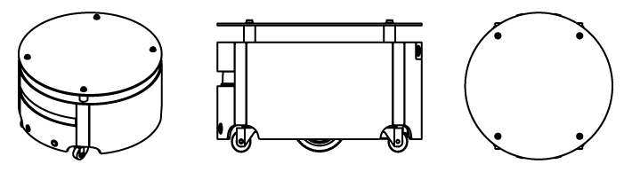

# Caster ROS

## Overview

IQR Caster robot ROS packages, contains caster_robot and caster_desktop installer.

## License
This project is licensed under the [MIT License](LICENSE).
© 2019 Beijing I-Quotient Robot Technology Co., Ltd. All Rights Reserved

## ROS package
Caster ROS package has three parts, See below for details.

 - [caster_robot][1]: hardware driver etc.
 - [caster_desktop][2]: visualize, control, and communicate tools
 - [caster_description][3]: robot description(URDF) for caster

## caster_robot
ROS packages for the IQR Caster robot, for operating Caster robot hardware. 

 - caster_app : Application 
 - caster_base] : Hardware interface 
 - caster_control : ROS controller configuration
 - caster_navigation : Navigation configurations and launch files

## caster_desktop
Desktop ROS packages for the IQR Caster, which may pull in graphical dependencies.

 - caster_viz : Visualization (rviz) configuration and bringup
 - caster_teleop : Joystick teleop configuration and launch file

## caster_description
ROS packages for the IQR Caster, which contains robot description (URDF)

------
© 2019 Beijing I-Quotient Robot Technology Co., Ltd. All Rights Reserved

[1]: https://github.com/I-Quotient-Robotics/caster_robot
[2]: https://github.com/I-Quotient-Robotics/caster_desktop
[3]: https://github.com/I-Quotient-Robotics/caster_description